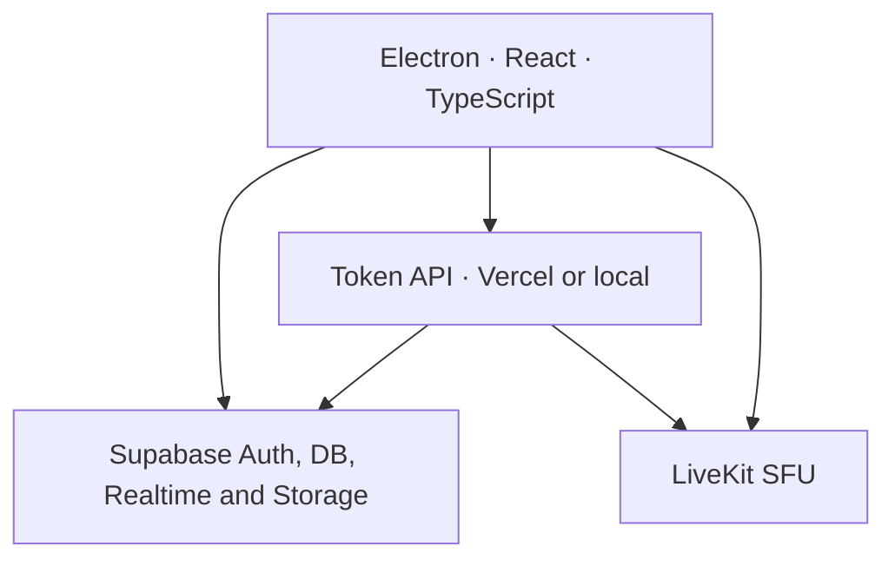

# FungoCord

Community application built from scratch. The client is an Electron application using React and TypeScript; data and authentication are handled by Supabase; voice, camera, and screen sharing are powered by a LiveKit SFU server.

## What's ready

- Email sign-up and login (optional), with sessions encrypted through the operating system's native credential vault.
- Servers, text/voice channels, and invite links with a landing page, automatic opening through the `fungocord://` protocol, and in-app confirmation.
- Real-time messages and direct conversations, with replies, `@user`, `@everyone`, and visual mention highlighting.
- Roles with colors, hierarchy, and granular permissions, including the Administrator permission, which grants all permissions.
- Kicking, banning, unbanning, audit logging, and hierarchy protection enforced directly at the database level.
- Online presence, complete server member lists, and people search.
- Centralized calls with all participants visible (the call member list is currently a bit buggy), microphone/camera states, multiple simultaneous streams, and remote audio.
- Persistent calls in PiP mode while navigating the app, plus locally saved individual volume controls for each person and stream.
- Selectable call stage: any person, camera, or stream can be highlighted in the center; the remaining items are arranged in a bottom tray, and only the selected stream plays audio.
- Authorized owners and moderators can disconnect members from a call or move them to another room through the context menu and drag-and-drop.
- Application settings for selecting the microphone, headphones/speakers, and camera, with echo cancellation, noise suppression, automatic gain control, and video preferences.
- Window or monitor sharing at 480p, 720p, 1080p, 1440p, or native resolution; 5, 15, 30, or 60 FPS; system audio and preview.
- Stateless API ready for Vercel (uploading through GitHub makes the process easier), local server listening on `0.0.0.0`, and installable/portable Windows builds.
- Row Level Security policies in the database, member validation before issuing call tokens, and an Electron environment isolated from Node.js.

## Architecture



There is no direct connection between clients: messages flow through Supabase, and all media passes through LiveKit.

## Quick Start Locally on Windows

Requirements for hosting/building only: Windows 10/11, Node.js 24+, Git, and Docker Desktop with at least 7 GB of available RAM.

1. Right-click `iniciar-local.bat` and choose **Run as administrator** to allow the required ports through the Firewall.
2. On the first run, wait for the dependencies to be installed and the containers to be downloaded.
3. The script detects the main IPv4 address, starts Supabase and LiveKit, applies the migration, and launches the API and Electron.
4. To stop the containers, run `parar-local.bat` and close the two development windows.

The HTTP server listens on all interfaces. To manually select the IP address advertised by LiveKit, run `set DISCORD2_LAN_IP=192.168.1.50` in the same terminal beforehand.

| Service | Port | Protocol |
|---|---:|---|
| FungoCord API | 8787 | TCP |
| Supabase API | 54321 | TCP |
| LiveKit signaling | 7880 | TCP |
| LiveKit ICE/TCP | 7881 | TCP |
| LiveKit ICE/UDP | 7882 | UDP |

## Production Deployment

1. Create a project in Supabase and run `enviar-banco-supabase.bat`. The script authenticates the CLI, links the project, and pushes the complete migration.
2. Create a project on LiveKit Cloud or host your own LiveKit instance with TLS.
3. On Vercel, import the repository and select `apps/api` as the **Root Directory**. Keep the Build Command as `npm run build` and the Output Directory as `.next`; the `vercel.json` in this folder also sets these values to prevent duplicated paths. Add `SUPABASE_URL`, `SUPABASE_PUBLISHABLE_KEY`, `SUPABASE_SERVICE_ROLE_KEY`, `LIVEKIT_URL`, `LIVEKIT_API_KEY`, `LIVEKIT_API_SECRET`, `PUBLIC_LIVEKIT_URL`, and `ALLOWED_ORIGINS` under **Settings > Environment Variables**. Then deploy again. Use `publicar-vercel.bat` if you prefer using the CLI from the repository root.
4. Run `compilar-exe.bat`. Enter the Supabase public URL/key, Vercel API URL, and LiveKit URL. The NSIS installer and portable executable will be generated in `apps/desktop/release`.

The landing page is served from the Vercel project root. By default, its buttons point to the latest release on GitHub; optionally, configure `NEXT_PUBLIC_DOWNLOAD_URL` on Vercel with a direct download link.

## Publishing Application Updates

Run `publicar-update.bat`, enter a version higher than the current one, and provide a GitHub Personal Access Token with **Contents: Read and write** permission. The script builds the installer, creates a GitHub Release, and uploads the metadata used by the updater. FungoCord installations check for new versions when launched and every 30 minutes.

When updating or fixing an existing installation, run `enviar-banco-supabase.bat` again before rebuilding and choose option **1**. The initial migration is idempotent: it completes missing structures, recreates functions and access policies, and preserves existing accounts, messages, and other data. The script then applies any new migrations.

Only the compiler requires Node.js. End users receive a self-contained `.exe` and do not need Node.js, Python, or Docker.

## Replacing a GitHub Repository

Run `publicar-github-git-bash.bat` to use Git Bash. The file is hybrid and self-contained: the BAT portion locates Git for Windows, while the Bash portion performs the entire verification and publishing process. You can also pass the repository URL as the first argument:

```bat
publicar-github-git-bash.bat https://github.com/usuario/repositorio.git
```

The script checks the remote before pushing. If the default branch already contains content, it displays a warning and requires `SUBSTITUIR` to be typed before running `git push --force`. Only the default branch of the specified repository is replaced; credentials are not stored in the project and are handled by Git Credential Manager. The original `publicar-github.bat` remains included as a Command Prompt-based alternative.

## Development Commands

```text
npm install
npm run typecheck
npm test
npm run dev
npm run build:desktop
```

Copy `.env.example` to `.env.local` when not using the automated workflow. Never expose `SUPABASE_SERVICE_ROLE_KEY` in Electron or in `VITE_*` variables.

## Structure

```text
apps/api             Next.js API for Vercel
apps/local-server    same API using Hono, listening on 0.0.0.0
apps/desktop         Electron + Vite + React + TypeScript
packages/contracts   shared validation and types
packages/server-core Supabase authorization and LiveKit tokens
supabase/migrations  schema, functions, and RLS policies
infra                local LiveKit
scripts              automated LAN environment setup
```

See [docs/ARQUITETURA.md](docs/ARQUITETURA.md) and [docs/SEGURANCA.md](docs/SEGURANCA.md) before deploying the environment to production.
