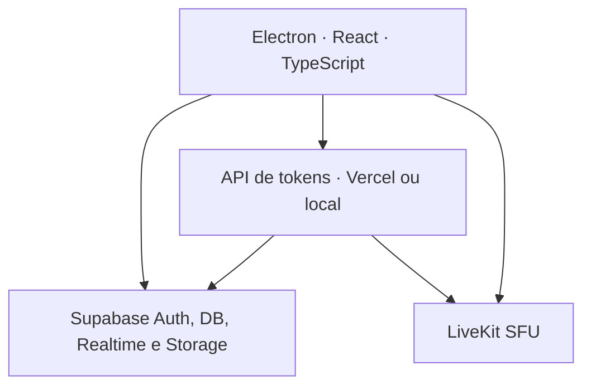

# FungoCord

Aplicativo de comunidade criado do zero, sem aproveitar o projeto C++ anterior e sem conexoes P2P entre usuarios. O cliente e um aplicativo Electron com React e TypeScript; dados e autenticacao usam Supabase; voz, camera e compartilhamento de tela passam por um servidor SFU LiveKit.

## O que esta pronto

- Cadastro e login por e-mail com sessao criptografada pelo cofre nativo do sistema operacional.
- Servidores, canais de texto/voz e links de convite com landing page, abertura automatica pelo protocolo `fungocord://` e confirmacao dentro do aplicativo.
- Mensagens e conversas diretas em tempo real, com respostas, `@usuario`, `@everyone` e destaque visual de mencoes.
- Cargos com cor, hierarquia e permissoes granulares, incluindo o poder Administrador que concede todos os poderes.
- Expulsao, banimento, remocao de ban, registro de auditoria e protecao de hierarquia aplicados no proprio banco.
- Presenca online, lista completa de membros por servidor e busca de pessoas.
- Chamadas centralizadas com todos os participantes visiveis, estados de microfone, camera, varias transmissoes simultaneas e audio remoto.
- Chamada persistente em modo PiP enquanto o usuario navega e volume individual, salvo localmente, para cada pessoa e transmissao.
- Palco de chamada selecionavel: qualquer pessoa, camera ou transmissao pode ser destacada no centro; os demais itens se ajustam em uma bandeja inferior e somente a transmissao assistida reproduz audio.
- Proprietarios e moderadores autorizados podem desconectar membros da call ou move-los para outra sala pelo menu de contexto e por arrastar-e-soltar.
- Configuracoes do aplicativo para escolher microfone, fone/alto-falante e camera, com cancelamento de eco, supressao de ruido, ganho automatico e preferencias de video.
- Compartilhamento de janela ou monitor com 480p, 720p, 1080p, 1440p ou resolucao original; 5, 15, 30 ou 60 FPS; audio do sistema e previa.
- API stateless pronta para Vercel, servidor local em `0.0.0.0` e build Windows instalavel/portatil.
- Politicas Row Level Security no banco, validacao de membro antes de emitir token de chamada e Electron isolado do Node.js.

## Arquitetura



Nao ha conexao direta entre clientes: mensagens fluem pelo Supabase e toda midia passa pelo LiveKit.

## Inicio rapido local no Windows

Requisitos apenas para quem hospeda/compila: Windows 10/11, Node.js 24+, Git e Docker Desktop com pelo menos 7 GB de RAM disponivel.

1. Clique com o botao direito em `iniciar-local.bat` e escolha **Executar como administrador** para liberar as portas no Firewall.
2. Na primeira execucao, aguarde a instalacao e o download dos containers.
3. O script detecta o IPv4 principal, inicia Supabase e LiveKit, aplica a migracao e abre a API e o Electron.
4. Para encerrar os containers, execute `parar-local.bat` e feche as duas janelas de desenvolvimento.

O servidor HTTP escuta em todas as interfaces. Para escolher manualmente o IP anunciado pelo LiveKit, execute antes `set DISCORD2_LAN_IP=192.168.1.50` no mesmo terminal.

| Servico | Porta | Protocolo |
|---|---:|---|
| API FungoCord | 8787 | TCP |
| Supabase API | 54321 | TCP |
| LiveKit sinalizacao | 7880 | TCP |
| LiveKit ICE/TCP | 7881 | TCP |
| LiveKit ICE/UDP | 7882 | UDP |

## Publicacao em producao

1. Crie um projeto no Supabase e execute `enviar-banco-supabase.bat`. O script autentica o CLI, vincula o projeto e envia a migracao completa.
2. Crie um projeto no LiveKit Cloud ou hospede seu proprio LiveKit com TLS.
3. Na Vercel, importe o repositorio e selecione `apps/api` como **Root Directory**. Mantenha o Build Command como `npm run build` e o Output Directory como `.next`; o `vercel.json` dessa pasta tambem fixa esses valores para impedir caminhos duplicados. Cadastre `SUPABASE_URL`, `SUPABASE_PUBLISHABLE_KEY`, `SUPABASE_SERVICE_ROLE_KEY`, `LIVEKIT_URL`, `LIVEKIT_API_KEY`, `LIVEKIT_API_SECRET`, `PUBLIC_LIVEKIT_URL` e `ALLOWED_ORIGINS` em **Settings > Environment Variables**. Depois faca um novo deploy. Use `publicar-vercel.bat` se preferir o CLI a partir da raiz do repositorio.
4. Execute `compilar-exe.bat`. Informe a URL/chave publica do Supabase, URL da API Vercel e URL do LiveKit. O instalador NSIS e o executavel portatil saem em `apps/desktop/release`.

A landing page e servida pela raiz do projeto Vercel. Por padrao, seus botoes levam ao release mais recente no GitHub; opcionalmente configure `NEXT_PUBLIC_DOWNLOAD_URL` na Vercel com um link de download direto.

## Publicar atualizacoes do aplicativo

Execute `publicar-update.bat`, informe uma versao maior que a atual e um GitHub Personal Access Token com permissao **Contents: Read and write**. O script compila o instalador, cria um GitHub Release e envia os metadados usados pelo atualizador. Instalacoes do FungoCord verificam novas versoes ao abrir e a cada 30 minutos.

Ao atualizar ou corrigir uma instalacao existente, execute `enviar-banco-supabase.bat` novamente antes de recompilar e escolha a opcao **1**. A migracao inicial e idempotente: completa estruturas ausentes, recria funcoes e politicas de acesso e preserva contas, mensagens e demais dados existentes. Em seguida, o script aplica as migracoes novas.

Somente o compilador precisa de Node.js. Os usuarios finais recebem um `.exe` autocontido e nao precisam de Node.js, Python ou Docker.

## Substituir um repositorio no GitHub

Execute `publicar-github-git-bash.bat` para usar o Git Bash. O arquivo e hibrido e autocontido: a parte BAT localiza o Git for Windows e a parte Bash executa toda a verificacao e publicacao. Tambem e possivel passar a URL como primeiro argumento:

```bat
publicar-github-git-bash.bat https://github.com/usuario/repositorio.git
```

O script consulta o remoto antes de enviar. Se a branch padrao ja tiver conteudo, ele exibe um alerta e exige que seja digitado `SUBSTITUIR` antes do `git push --force`. Apenas a branch padrao do repositorio informado e substituida; credenciais nao sao salvas no projeto e ficam a cargo do Git Credential Manager. O `publicar-github.bat` original continua incluido como alternativa baseada no Prompt de Comando.

## Comandos de desenvolvimento

```text
npm install
npm run typecheck
npm test
npm run dev
npm run build:desktop
```

Copie `.env.example` para `.env.local` quando nao utilizar o fluxo automatico. Nunca exponha `SUPABASE_SERVICE_ROLE_KEY` no Electron nem em variaveis `VITE_*`.

## Estrutura

```text
apps/api             API Next.js para Vercel
apps/local-server    mesma API em Hono, ligada em 0.0.0.0
apps/desktop         Electron + Vite + React + TypeScript
packages/contracts   validacao e tipos compartilhados
packages/server-core autorizacao Supabase e tokens LiveKit
supabase/migrations  esquema, funcoes e politicas RLS
infra                LiveKit local
scripts              preparacao automatizada do ambiente LAN
```

Consulte [docs/ARQUITETURA.md](docs/ARQUITETURA.md) e [docs/SEGURANCA.md](docs/SEGURANCA.md) antes de colocar o ambiente em producao.
